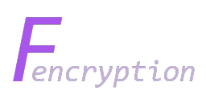

<p align="center">
  <a href="#readme">
    
  </a>

  <p align="center">
    <a href="https://img.shields.io/github/workflow/status/valflrt/fencryption/build"></a>
    <a href="./LICENSE"></a>
  </p>

  <p align="center">
    <a href="https://github.com/valflrt/Fencryption/releases/latest"><b>Download</b></a>
    <br />
    <a href="https://github.com/valflrt/fencryption/issues/new"><b>Report Bug</b></a>
  </p>
</p>

# Fencryption

A simple cli program to encrypt a directory or a file, made with nodejs and typescript.

- [Fencryption](#fencryption)
  - [Usage](#usage)
  - [Features](#features)
  - [Development](#development)
    - [How to build/compile](#how-to-buildcompile)

## Usage

```
Usage: fencryption [options] [command]

A simple cli program to encrypt a file/directory

Options:
  -V, --version                     output the version number
  --verbose                         verbose mode
  --debug                           debug mode
  -h, --help                        display help for command

Commands:
  encrypt|e [options] <path> <key>  encrypts a file/directory
  decrypt|d [options] <path> <key>  decrypts an encrypted file/directory
  help [command]                    display help for command
```

You can also get help about commands using `fencryption help [command]` or `fencryption [command] --help`

## Features

- Encrypt and decrypt a file or a directory with the key of your choice (when encrypting a directory, file/directory names are also encrypted)

## Development

### How to build/compile

- Use `npm run build` in the project directory to build.
- Use `npm run build:binaries` to create an executable.
